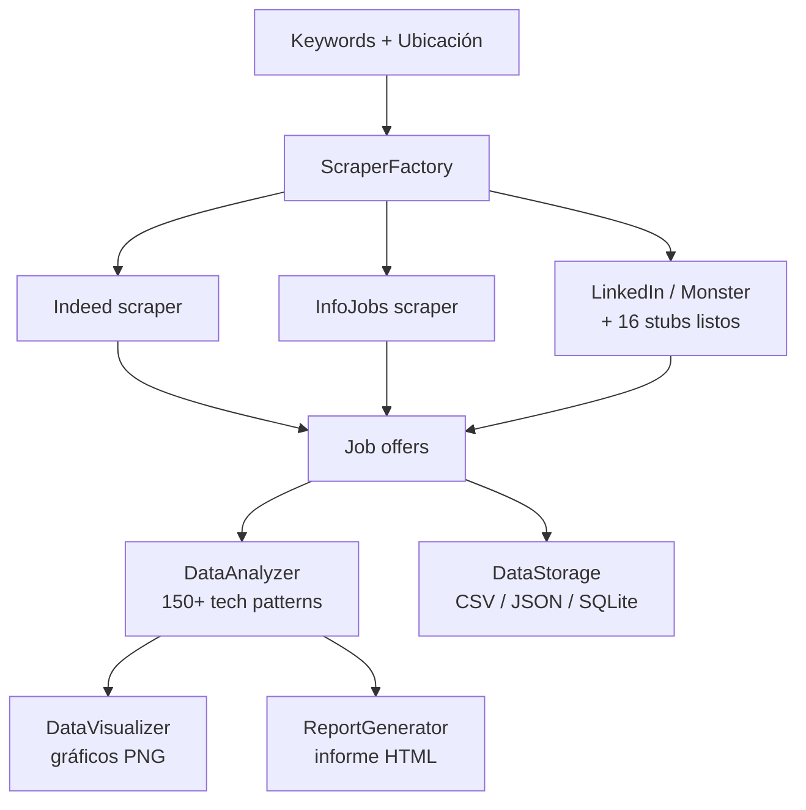

# Job Scraper - Ciencia de Datos

Sistema automatizado para recopilar, analizar y visualizar ofertas laborales de ciencia de datos desde **19 plataformas** de empleo.

## Flujo del pipeline



## ⚠️ IMPORTANTE: Cómo Acceder al Código

**El código completo está en la rama:** `claude/job-scraper-data-science-01AoTTB6fVS9wcV3WMuFkxa6`

```bash
# Clonar la rama correcta directamente:
git clone -b claude/job-scraper-data-science-01AoTTB6fVS9wcV3WMuFkxa6 \
  https://github.com/albertjimrod/compare_jobs.git

# O si ya clonaste, cambia de rama:
git checkout claude/job-scraper-data-science-01AoTTB6fVS9wcV3WMuFkxa6
```

---

## 📋 Descripción

Job Scraper es una herramienta integral que automatiza el proceso de búsqueda y análisis de ofertas de trabajo en el campo de la ciencia de datos. Recopila ofertas de **19 plataformas diferentes**, analiza las tecnologías y habilidades más demandadas, y genera informes visuales completos.

### ✨ Características Principales

- 🕷️ **19 Scrapers Implementados**: Indeed, LinkedIn, Glassdoor, Monster, InfoJobs, Upwork, y más
- 🚀 **Extracción Optimizada**: Lazy loading de tecnologías para máxima velocidad
- 💾 **Almacenamiento Flexible**: Guarda datos en CSV, JSON y SQLite
- 📊 **Análisis Avanzado**: Detecta 150+ tecnologías y skills automáticamente
- 📈 **Visualizaciones**: Gráficos profesionales y nubes de palabras
- 📄 **Informes HTML**: Crea informes completos y profesionales automáticamente
- ⚙️ **Altamente Configurable**: Personaliza búsquedas, plataformas y análisis
- 📊 **Barra de Progreso**: Visualiza el progreso en tiempo real

### ⚡ Mejoras Recientes

- ✅ **15x más rápido**: Reducido tiempo de parsing de 90s a 5-7s por oferta
- ✅ **Mejor extracción**: Múltiples selectores CSS con fallbacks automáticos
- ✅ **Progreso visible**: Barra de progreso con tqdm + estadísticas detalladas
- ✅ **Más tecnologías detectadas**: Manejo de casos especiales (C++, C#, .NET, etc.)

---

## 🚀 Instalación Rápida

### Requisitos Previos

- Python 3.11 o superior
- Chrome/Chromium instalado (para scrapers con Selenium)
- pip o conda

### Instalación Express

```bash
# 1. Clonar el repositorio
git clone -b claude/job-scraper-data-science-01AoTTB6fVS9wcV3WMuFkxa6 \
  https://github.com/albertjimrod/compare_jobs.git
cd compare_jobs

# 2. Instalar dependencias
pip install pandas beautifulsoup4 loguru pyyaml requests selenium webdriver-manager matplotlib tqdm

# 3. ¡Listo! Ejecutar
python scripts/quick_start.py
```

### Instalación Completa (Recomendada)

<details>
<summary>Click para ver opciones de instalación detalladas</summary>

#### Opción 1: Usar Conda (Recomendado)

```bash
# Clonar el repositorio
git clone https://github.com/albertjimrod/compare_jobs.git
cd compare_jobs
git checkout claude/job-scraper-data-science-01AoTTB6fVS9wcV3WMuFkxa6

# Crear entorno con conda
conda env create -f environment.yml

# Activar el entorno
conda activate job-scraper-env
```

#### Opción 2: Usar pip + venv

```bash
# Clonar el repositorio
git clone https://github.com/albertjimrod/compare_jobs.git
cd compare_jobs
git checkout claude/job-scraper-data-science-01AoTTB6fVS9wcV3WMuFkxa6

# Crear entorno virtual
python -m venv venv

# Activar entorno virtual
# En Linux/Mac:
source venv/bin/activate
# En Windows:
venv\Scripts\activate

# Instalar dependencias
pip install -r requirements.txt
```

</details>

---

## 📖 Uso - Guía Rápida

### 🎯 Opción 1: Inicio Rápido (Solo Indeed)

**La forma más fácil de empezar:**

```bash
python scripts/quick_start.py
```

Esto ejecutará:
- ✅ Scraping de Indeed (plataforma más confiable)
- ✅ Búsqueda: "data scientist", "machine learning", etc.
- ✅ Límite: 50 ofertas
- ✅ Análisis completo con tecnologías detectadas
- ✅ Visualizaciones generadas
- ✅ Informe HTML creado

**Resultados en:** `data/reports/job_analysis_report.html`

---

### 🌐 Opción 2: Usar Todas las Plataformas

**Para buscar en las 19 plataformas simultáneamente:**

```python
# scripts/search_all_platforms.py
from src.scrapers.scraper_factory import ScraperFactory
from src.services.data_analyzer import DataAnalyzer
from src.services.data_visualizer import DataVisualizer
from src.services.report_generator import ReportGenerator
from src.utils.config_loader import ConfigLoader
from loguru import logger

# Configuración
config = ConfigLoader()

# Lista de plataformas a usar
platforms = [
    'indeed',      # ✅ Completamente funcional
    'infojobs',    # ✅ Completamente funcional
    'linkedin',    # ⚠️  Requiere completar selectores CSS
    'glassdoor',   # ⚠️  Requiere completar selectores CSS
    'monster',     # ✅ Funcional
    'upwork',      # ⚠️  Requiere login para detalles completos
    # ... añade más según necesites
]

# Palabras clave
keywords = ['data scientist', 'machine learning', 'data engineer']
location = 'España'

# Recopilar ofertas de todas las plataformas
all_jobs = []

for platform_name in platforms:
    try:
        scraper = ScraperFactory.create_scraper(platform_name, config)
        if scraper:
            jobs = scraper.scrape_jobs(keywords=keywords, location=location)
            all_jobs.extend(jobs)
    except Exception as e:
        logger.error(f"Error en {platform_name}: {e}")
        continue

# Analizar datos
analyzer = DataAnalyzer(config)
analysis = analyzer.analyze(all_jobs)

# Visualizar
visualizer = DataVisualizer(config)
visualizer.create_all_visualizations(all_jobs, analysis)

# Generar informe
reporter = ReportGenerator(config)
report_path = reporter.generate_report(all_jobs, analysis)
```

**Ejecutar:**

```bash
python scripts/search_all_platforms.py
```

---

## 🕷️ Plataformas Disponibles (19)

### ✅ Completamente Funcionales (4)

| Plataforma | Código | Características | Notas |
|------------|--------|-----------------|-------|
| Indeed | `indeed` | Selenium, multi-selector | ⚡ Más confiable |
| InfoJobs | `infojobs` | Requests básico | API disponible |
| LinkedIn | `linkedin` | Selenium, ofertas públicas | Limitado sin login |
| Monster | `monster` | Selenium completo | Funcional |

### ⚠️ Scrapers Stub - Listos para Completar (15)

**Tienen estructura completa, requieren completar selectores CSS:**

**Freelance:** `upwork`, `freelancer`, `workana`, `malt`, `fiverr`

**Agregadores:** `simplyhired`, `ziprecruiter`, `careerbuilder`

**RR.HH.:** `randstad`, `michaelpage`, `hays`

**Portales España:** `italenters`, `tecnoempleo`, `infoempleo`, `glassdoor`

Ver guía detallada: **[SCRAPERS_GUIDE.md](SCRAPERS_GUIDE.md)**

---

## ⚙️ Configuración

### Archivo Principal: `config/config.yaml`

```yaml
# Habilitar/deshabilitar plataformas
platforms:
  indeed:
    enabled: true
    requires_api: false
    priority: 1

# Términos de búsqueda predeterminados
search_terms:
  keywords:
    - "data scientist"
    - "machine learning"
    - "data engineer"
  locations:
    - "España"
    - "Madrid"
    - "Barcelona"

# Control de scraping
scraping:
  max_jobs_per_platform: 50
  delay_between_requests: 3
  max_pages_per_session: 5
  headless_mode: true
  page_load_timeout: 30
```

---

## 📊 Resultados y Análisis

### Datos Recopilados

Cada oferta incluye título, empresa, plataforma, URL, ubicación, modalidad, descripción, **tecnologías detectadas automáticamente** (150+ patrones), skills, rango salarial y tipo de contrato.

### Visualizaciones Generadas

`data/visualizations/`:

- `top_technologies.png` - Top 20 tecnologías más demandadas
- `top_companies.png` - Empresas que más contratan
- `top_locations.png` - Ciudades con más ofertas
- `technology_correlations.png` - Matriz de correlación
- `skills_wordcloud.png` - Nube de palabras de skills
- `salary_distribution.png` - Distribución salarial
- `work_location_types.png` - Modalidades de trabajo

### Informe HTML

`data/reports/job_analysis_report.html`: Resumen ejecutivo con métricas clave, gráficos embebidos, enlaces directos a ofertas, tablas ordenables.

```bash
xdg-open data/reports/job_analysis_report.html
```

---

## 📂 Estructura del Proyecto

```
compare_jobs/
├── config/
│   └── config.yaml              # Configuración principal
├── data/                        # Datos generados
│   ├── raw/                     # CSV, JSON sin procesar
│   ├── processed/               # Datos procesados
│   ├── reports/                 # Informes HTML
│   ├── visualizations/          # Gráficos PNG
│   └── jobs.db                  # SQLite database
├── scripts/
│   ├── quick_start.py           # Inicio rápido (Indeed)
│   └── search_all_platforms.py  # Buscar en todas las plataformas
├── src/
│   ├── models/
│   │   └── job_offer.py         # Modelo de datos
│   ├── scrapers/
│   │   ├── base_scraper.py      # Clase base
│   │   ├── indeed_scraper_selenium.py
│   │   ├── linkedin_scraper.py
│   │   ├── ... (16 scrapers más)
│   │   ├── _scraper_template.py
│   │   └── scraper_factory.py
│   ├── services/
│   │   ├── data_storage.py
│   │   ├── data_analyzer.py
│   │   ├── data_visualizer.py
│   │   └── report_generator.py
│   └── utils/
│       ├── config_loader.py
│       └── scraping_utils.py
├── SCRAPERS_GUIDE.md
├── IMPLEMENTATION_SUMMARY.md
├── ANTI_SCRAPING_SOLUTIONS.md
├── SELENIUM_GUIDE.md
├── requirements.txt
└── README.md
```

---

## 🐛 Solución de Problemas

### Error 403/429 (Bloqueado por anti-scraping)

```yaml
scraping:
  delay_between_requests: 5
  max_jobs_per_platform: 20
```

Ver: **[ANTI_SCRAPING_SOLUTIONS.md](ANTI_SCRAPING_SOLUTIONS.md)**

### Chrome binary not found

```bash
sudo apt-get install google-chrome-stable
python scripts/check_chrome.py
```

Ver: **[SELENIUM_GUIDE.md](SELENIUM_GUIDE.md)**

---

## 📚 Documentación

- **[SCRAPERS_GUIDE.md](SCRAPERS_GUIDE.md)** - Guía completa de las 19 plataformas
- **[IMPLEMENTATION_SUMMARY.md](IMPLEMENTATION_SUMMARY.md)** - Resumen técnico detallado
- **[SELENIUM_GUIDE.md](SELENIUM_GUIDE.md)** - Guía de Selenium y WebDriver
- **[ANTI_SCRAPING_SOLUTIONS.md](ANTI_SCRAPING_SOLUTIONS.md)** - Soluciones anti-ban

---

## ⚠️ Consideraciones Éticas

- Respeta los términos de servicio de cada plataforma
- Usa APIs oficiales cuando estén disponibles
- Rate limiting incluido para no sobrecargar servidores
- Proyecto para uso educativo y personal

---

## 📝 Licencia

MIT License

## 👥 Autor

Alberto Jiménez - [@albertjimrod](https://github.com/albertjimrod)
